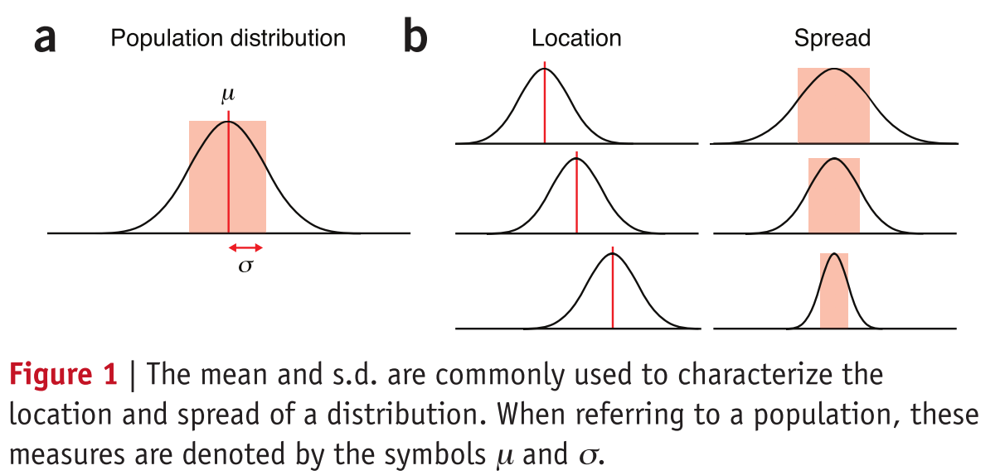
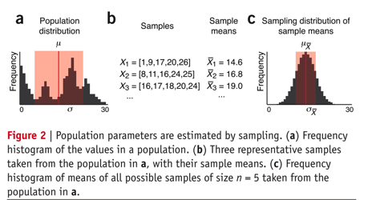

# [Importance of being uncertain](https://www.nature.com/articles/nmeth.2613)

>**统计并不会告诉我们我们是不是对的，而是告诉我们我们错误的可能性有多大。**

是不是很熟悉? _p value_ 啊。

>每当我们做一个重复实验的时候，我们不太可能重复出来**完全一样**的结果。由于生物的变化以及测量精度的限制，重复的实验将会测量目标值的范围。但是如果每次的测量值都不同，我们如何能说明，这个实验符合我们的假设，能够证明我们的假设理论没有问题？

>“科学的最大的悲剧就是，最美丽的假设理论都是被最丑陋的数据所屠戮。”而且这“丑陋”居然还没有办法测量。

科学版的“美女与野兽”。而且当别人问野兽有多丑时，我们只能回答，“有点丑”或者“非常丑”。

>然而统计却能帮助我们回答这个问题。它能帮助我们对实验中观察到的某一现象（数据）进行定量的可能性评估。同时还告诉我们数据并不是准确的测量，还是伴有一定错误的估计。丫还能告诉我们计算过程中的错误是如何从输入数据中传递进来的。这要理论框架，能够描述实验结果的不确定性，同时也能对我们从观察数据中得到的一般规律给出一个置信度的描述。

>尽管统计中的很多基本原理可以被很直观的理解，但在真实情况下，特别是涉及到“可能”及“概率”的时候，我们需要摒弃我们的直觉印象。
【FYI】虽然统计中的许多基本概念可以被很直观地理解，但作为对自然模式的探寻者，我们必须在考虑“可能性”和“概率”时认识到我们所谓的“直觉”（或者说对事物已有的认知）是有局限性的。

`Although many fundamental concepts in statistics can be understood intuitively, as natural pattern-seekers we must recognize the limits of our intuition when thinking about chance and probability.`我觉得这一部分我必须贴上原文，因为感觉上怎么翻译都是怪怪的。

>`Monty Hall`问题就是一个非常经典的例子，我们是如何既快又确信的得出一个错误的答案。

后面就主要是描述这个`Monty Hall`场景的。

>规则规定，一个参赛者需要从三个门中作出选择，选择对的门，可以获得一个奖励。当参赛者选择一扇门后（假设A门），主持人会打开另外两扇门中没有奖励的门（假设B门，如果剩下两扇门都没有奖励，就随便开一扇），然后给予参赛者第二次选择的机会，可以让参赛者重新选择没开又没有被选择的门（门C）。令人恼火的事情就是，作为参赛者，到底是应该换门C还是坚持自己选择门A。

为了方便大家理解，我从网上找了维基百科上对于这个游戏规则的描述：这个游戏的玩法是：参赛者会看见三扇关闭了的门，其中一扇的后面有一辆汽车或者是奖品，选中后面有车的那扇门就可以赢得该汽车或奖品，而另外两扇门后面则各藏有一只山羊或者是后面没有任何东西。当参赛者选定了一扇门，但未去开启它的时候，知道门后情形的节目主持人会开启剩下两扇门的其中一扇，露出其中一只山羊。主持人其后会问参赛者要不要换另一扇仍然关上的门。问题是：换另一扇门会否增加参赛者赢得汽车的机会率？

>答案是，选择换。but you would be in good company if you thought otherwise.

上面的英文的确不知道该怎么翻译，咨询了两位[@Nana7926](https://github.com/Nana7926)和[@Susuqu](https://github.com/Susuqu)，分别给出了下列两种供参考

- “但是如果你不这么想的话 你会在一个好公司” from [@Nana7926](https://github.com/Nana7926)
- “但如果你不这样想，你会有好的公司” from [@Susuqu](https://github.com/Susuqu)

最初我的想法也是其实没有什么差别，换与不换没有差别的。

>当这个答案发布在《Parada》杂志的时候，数以千计的读者（很多都是博士）反馈这个答案是错误的。评论千奇百怪，从“你错了，但是从积极的一面看，如果这些博士都是错的，那国家岂不是要陷入一些大的麻烦了” 到 “我必须承认我质疑你，除非我五年级的数学课能证明你是对的”

这一段其实完完全全是按照原文翻译，可是读起来总觉得太奇怪了，这说的是什么啊。暂时先这样写着，具体部分后续在慢慢斟酌。

>`The Points of Significance`系列就是让你工作中的与基础统计相关的理解能不被最初“感觉”出来的理解所左右。目的也很明确，就是处理“几乎半数医学杂志上发表的论文在用到统计方法的时候都是错误的”这样的状况。我们会以实际且令人信服的方式来进行介绍。我们主要聚焦在基础概念，实际技巧及常见的错误。

>每篇介绍都会有一个excel表格来展示计算式，主要展现数据及结果，不会用公式来迷惑大家。

这点非常的棒，过去课本中的统计大部分都是以公式及少量数据说明，一般很难了解到过程。正好有excel的支持，可以很清晰的看出结果随着数据的变化而产生的变化。

>统计可以大致分为两类：描述和推断。

描述现在所有数据的特性，推断新的数据可能的特性。

>第一个（描述）通过一些测量，例如`均值`、`标准差`来概括数据集的主要特征。第二个（推断）则是通过观察数据推断更大数据集的特性。而支撑他们的理论就是抽样及估计，抽样就是收集数据，而估计就是量化推断出的结果的不确定性。

>为了探讨`抽样`，我们需要首先介绍一个`总体`的概念，`总体`表示我们做推断的事物的集合。`群体`中的某一个实验变量的所有可能值的频率柱状图就是`总体分布`，如[^chap1-1]中的a图。我们也一贯的对于推断总体的`均值`和`标准差`感兴趣。`均值`和`标准差`分表描述了`总体`的位置还有展开的宽度，如[^chap1-1]中的b图。

>`均值`就是计算所有值的`算术平均数`，当有`极值`时，会产生错误的推断。相比之下`中值`就是对于位置描述更为鲁棒的一个概念。特别是对于一些`偏分布`及其他不规则的形状，`中值`更加合适。

>`标准差`计算是根据每个值距离`均值`的距离的平方进行计算的。有的时候可以用`方差`（`标准差`的平方），因为他的特性更容易用数学公式来表示。

>`标准差`并不是一个直觉的测量值，“拇指规则”能够帮助我们做一些解释。

拇指规则(_RULE OF_ _THUMB_) ，中文又译为“大拇指规则 ”，又叫”经验法则“，是一种可用于许多情况的简单的，经验性的，探索性的但不是很准确的原则。

>例如，对于一个正态分布来说，39%，68%，95%，99.7%的值是落入$\pm 0.5\sigma$，$\pm 1\sigma$，$\pm 2\sigma$，$\pm 3\sigma$这个范围内的。这些阈值对于`非正态分布`来说并不适用，对于`非正态分布`来说，`分位数`是一个更好也更直观的描述方式。

>财政及实际操作上的限制导致我们没有办法去获得`总体`的`均值`及`标准差`。我们最好使用收取部分数据，也就是`抽样`，来估计出这些，如[^chap1-2]中所示。

>即便`总体`的取值是一个很狭窄的取值范围，比如只是0到30，如[^chap1-2]中的a图。因为`抽样`的随机性，所以我们对`总体`的形状的估计并不能很准确。`样本`表示的是从`总体`中抽取的数据集合，如[^chap1-2]中的图b，使用数据的数目`n`来描述。一般使用`X`来表示，还会使用下角标来表示抽样的次序，如$X_1$。样本数越大，`抽样`的`样本`就越接近`总体`。

>为了保持有效性，`样本`必须能够表示`总体`。
【FYI】个人觉得这样翻译很合适，因为其实就是想说明我们在总体中所选择的样本，必须可以代表总体的特征，否则抽取的样本的特征无法有效地代表总体特征。

` To maintain validity, the sample must be representative of the population.`这个也是翻译及理解起来有些疑问的地方。

>为了达到这一目的，其中一个方法就是简单的`随机抽样`，就是总体中的所有值在`抽样`的过程中，都用同等的机会被抽到。能够表示`总体`，并不代表`样本`就是`总体`的一个缩略图。一般来讲，一个样本只有在`n`非常大的时候才会和总体相似。

>当描述一个`样本`的时候，并不能很明显的就能分辨出它是不是有偏的。例如，调查的`样本`只是那些同意参与调查的个体，而并没有那些不同意参与调查的个体的信息。这两个组就有可能差异很大。

这就相当于，调查男生和女生是否同样爱玩游戏，结果都在街上进行调查，而真正爱玩游戏的男生和女生可能很少上街。这个时候调查到的结果可能是男生1%，女生1%爱玩游戏。但真正情况，100个男生中，有50个都在家里玩游戏呢，而100个女生中，只有10个在家玩游戏。（例子是我能想到最合适的了，以后再有比较合适的再补充进去）

>`样本`是我们窥探`总体`的窗口，他们的统计结果用来估计`总体`。

“管中窥豹”，用局部估计全部，有可能是有偏差的，也有可能是没有的。

>`样本`的`均值`和`标准差`使用 $\bar{X}$ 和 $s$ 表示。`样本`和`总体`的变量的区别就是使用`样本`使用罗马字母，而`总体`使用希腊字母（就像  $s$ 和 $\sigma$ ）。

>样本的参数，比如$\bar{X}$就有它自己的分布，叫做抽样分布，如图[^chap2-2]的图c，这就是一个考虑到给定样本大小的所有可能性的一个分布。`样本`分布的参数用一个带角标的`样本`变量来表示（例如，$\mu_{\bar{X}}$和$\sigma_{\bar{X}}$表示所有`样本`的$\bar{X}$的`均值`和`标准差`）

稍微有点绕口，其实就是均值的均值，均值的标准差。

>就像`总体`一样，`抽样`的分布也不可能获得所有的`样本`结果来直接获得。但是，它还是成为了一个对于`总体`统计的一个非常重要的概念。

>需要注意的是，在[^chap1-2]c图中的`样本均值`的分布与[^chap1-2]a图中的`总体`的分布差异很大。事实上，`样本均值`的分布的形状和正态分布很相似，同样需要注意的是它的宽度（比如正态分布中的$\sigma$），$\sigma_{\bar{X}}$也比`总体`的宽度要小很多。

>尽管有这些差异，但是`总体`的分布与`样本均值`的分布还是非常有关联的。他们的联系可以用`中心极限定理（central limit theorem）`，这个既重要又基础的统计声明所描述。

>`中心极限定理`（如图[^chap1-2]图c）告诉我们`样本`的`均值`的分布随着`样本`大小的增加，将会越来越接近一个正态分布。而且这一现象是与`总体`分布的形状无关的（如图[^chap1-2]图a）。

翻译中少了一句话，有点没有理解，不知道该如何接上，原话是`The CLT tells us that the distribution of sample means (Fig. 2c) will become increasingly close to a normal distribution as the sample size increases, regardless of the shape of the population distribution (Fig. 2a) `**as long as the frequency of extreme values drops off quickly.** 后面黑体的部分就是没有翻译，不知道如何翻译的。

>`中心极限定理`还能将`样本`分布的参数与`总体`分布的参数联系起来，比如：$\mu_{\bar{X}}=\mu$，$\sigma_{\bar{X}}=\sigma/\sqrt{n}$。

第一部分对我来说非常的重要，就是很多有关于均值的估计其实我之前都不太理解，但是这一部分我理解了，而且会下意识的以后都向这一部分来想。

第二部分的`n`表示的是样本的大小，也就是'sample size'。

>第二部分的关系可能会有些让人疑惑：$\sigma_{\bar{X}}$表示的是`样本`的`均值`的变化幅度，而$\sigma$是`总体`的分布的变化幅度。当我们增加`n`，$\sigma_{\bar{X}}$就会下降（我们的`样本`将拥有更一致的`均值`），但是$\sigma$却不会改变（`抽样`不会改变`总体`的性质）。

>`样本`的`均值`的变化幅度，还有另一种说法就是`标准误`（s.e.m.，$SE_{\bar{X}}$）,而且被用来估计$\sigma_{\bar{X}}$。

到这可能有些概念有些让人混淆了，首先明确一些东西，就是有些东西是故有存在，但是我们无法观察到，只能进行估计的，例如`总体`的`均值`及`标准差`($\mu$，$\sigma$)，而通过`抽样`我们可以观察到`样本`的一些信息，如`均值`及`标准差`（$\bar{X}$及_s_）,而通过部分`样本`的信息，我们又可以观察到`样本`的`均值`的分布的一些信息，如`标准误`（$SE_{\bar{X}}$），而这个`标准误`可以用来估计本身`总体`的固有属性，就是$\sigma_{\bar{X}}$。

就是需要区分出，哪些是我们能够观察到的，哪些是以我们观察到的结果为基础去估计的“真实的，固有的”属性。

>举一个例子，来说明`中心极限定理`对于不同分布的`总体`，如[^chap1-3]，来展示，通过增加`样本`的大小，使得对于`总体`的`均值`的估计更加准确。

>需要注意的是，`样本`的`均值`可能离`总体`的`均值`很远，特别是在`样本`的大小很小（也就是`n`很小的时候）。例如，从一个不规则的分布中`抽样`10,000个大小为3的样本，重复10次，	`样本`的`均值`落到$\mu \pm s$（如图[^chap3]中的红色虚线内部）外的比例从7.6%到8.6%。

指的十次重复分别计算的比例。

>所以在用小样本量来描述`均值`的时候一定要谨慎。

落在$\mu \pm s$外说明与真实的`均值`差异较大了。（这是我的理解）

>需要时刻记住，测量出来结果只是一个估计，所以不要以一种“极其确定，确凿无疑”的态度进行描述。变化是无所不在的，这也就会使`抽样`所获取的`样本`都不是一样的。

>此外，就像之前提到的`中心极限定理`中的和 $1/\sqrt{n}$ 成比例的那一部分（$\sigma_{\bar{X}} = \sigma/\sqrt{n}$，`样本`估计`总体`的准确性的速度要比`样本`大小增加的速度要慢。

因为开了一个二次方。

>如图[^chap1-4]中，以[^chap1-2]图a中的`总体`分布为基础，`抽样`大小从1到100，来展示这一变化及一致性。先说结论，如果需要提高一倍的准确性，那就需要收集到4倍的数据量，这个从图中很容易观察出，只要仔细注意坐标的变化，及坐标所表示的意义。

[**原始文献及补充材料中的excel**](http://www.nature.com/doifinder/10.1038/nmeth.2613)
